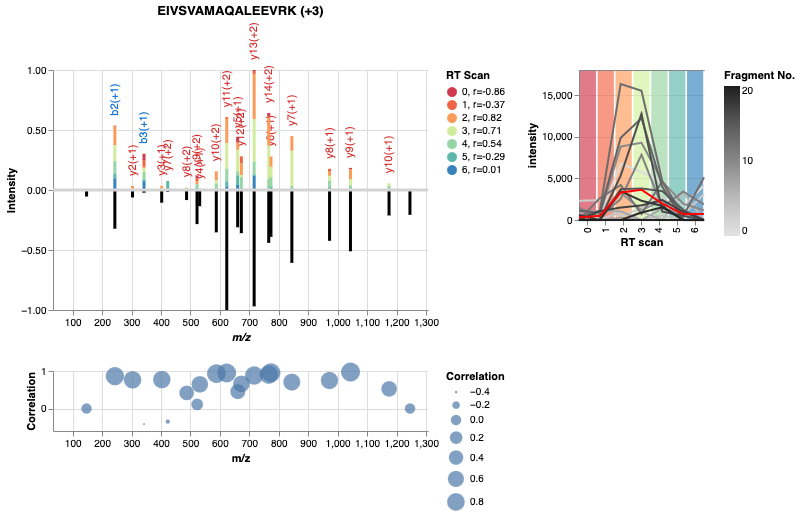
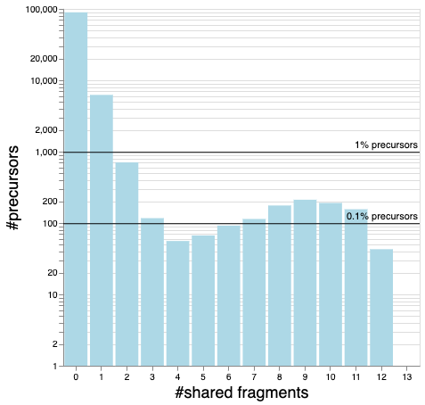

# alphadia-validate

A set of tools to validate DIA data.



See these two notebooks:
[showcase.ipynb](https://github.com/GeorgWa/alphadia-validate/blob/main/notebooks/showcase.ipynb) 
and 
[shared_fragment_histogram.ipynb](https://github.com/GeorgWa/alphadia-validate/blob/main/notebooks/shared_fragment_histogram.ipynb)

If you have any troubles, questions or suggestions, please get in touch,
e.g. by [opening an issue](https://github.com/GeorgWa/alphadia-validate/issues/new?template=Blank+issue).

## Data
The main notebook is designed to run self-contained, if you
don't provide data, it will download it.

If you want to use your own data, process a `.raw` file with AlphaDIA (cf. 
[search.ipynb]((https://github.com/GeorgWa/alphadia-validate/blob/main/notebooks/initial/search.ipynb))
and/or this [guide](https://alphadia.readthedocs.io/en/latest/guides/libfree-gui.html),
and save it together with the `precursors.tsv` and the `speclib.hdf` files here:
```bash
mkdir ~/alphadia-validate
```
Then point the notebook to the data (cf. "Set up data" cell)

## Run locally
1. create a conda environment, install AlphaDIA (cf. https://github.com/MannLabs/alphadia?tab=readme-ov-file#pip-installation)
```bash
pip install "alphadia[stable]==1.9.3-dev2""
```
2. (non-Windows) install `mono`
3. Install jupyter
4. Open the two main notebooks (cf. above) and start exploring 

## Run in Docker
This is a convenient solution to try this out without any modification to your system (except for Docker).
However, it just works with a pre-downloaded pickled raw data file.

1. Install [Docker](https://docs.docker.com/engine/install/ubuntu/).

2. Download the raw data (`dia_data` object) as a `pkl` file [here](https://datashare.biochem.mpg.de/s/pckjZUEBChOvA9v)
to `~/alphadia-validate`.
This is currently required because we didn't get mono to run in the container.

3. Clone this repository, `cd` into it and build the container
```bash
docker build -f Dockerfile --progress=plain -t alphadia-validiate .
```

4. Run the container
```bash
BASE_FOLDER=~/alphadia-validate
docker run -p 8888:8888 -v $BASE_FOLDER:/app/base/ -it alphadia-validiate
```

5. Open the Jupyter notebook in your browser: http://localhost:8888/notebooks/notebooks/showcase.ipynb
